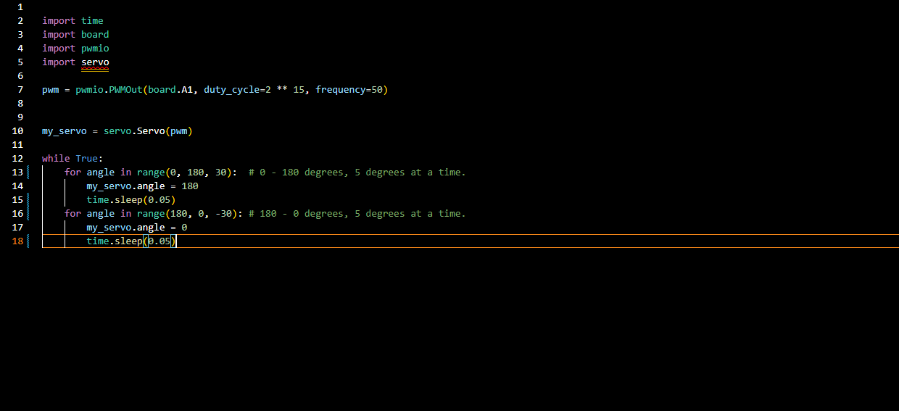

## Table of Contents
* [Table of Contents](#TableOfContents)
* [Hello_CircuitPython](#Hello_CircuitPython)
* [CircuitPython_Servo](#CircuitPython_Servo)
* [CircuitPython_LCD](#CircuitPython_LCD)
* [NextAssignmentGoesHere](#NextAssignment)
---

## Hello_CircuitPython

### Description & Code
We had to make the Neopixel on the metro board change colors.

Here's how you make code look like code:

```python
import board
import neopixel
import time

dot = neopixel.NeoPixel(board.NEOPIXEL, 1)
dot.brightness = 0.5 

print("Make it Blue!")

while True:
    dot.fill((255, 0, 0))
    time.sleep(1.0)
    dot.fill((0, 255, 0))
    time.sleep(1.0)
    dot.fill((0, 0, 255))
    time.sleep(1.0)

```


### Evidence


And here is how you should give image credit to someone, if you use their work:


### Wiring
Make an account with your google ID at [tinkercad.com](https://www.tinkercad.com/learn/circuits), and use "TinkerCad Circuits to make a wiring diagram."  It's really easy!  
Then post an image here.   [here's a quick tutorial for all markdown code, like making links](https://guides.github.com/features/mastering-markdown/)

### Reflection
What went wrong / was challenging, how'd you figure it out, and what did you learn from that experience?  Your ultimate goal for the reflection is to pass on knowledge that will make this assignment better or easier for the next person.


## CircuitPython_Servo
I was tasked with making a servo sweep from 0 to 180 using Circuit Python.
This repo is a template VS code project for CircuitPython projects that automatically uploads your code to the board when you press F5.
### Description & Code
The Imports I used were Time, Board, PWMIO, and Servo.mpy. Servo.mpy allows the servo to move in two directions when you use the range function. I put the three important values for the range in the parenthesis, first the Minimum value, then the maximum value, and finally the number of degrees the servo will move each period of time.
```python
import time
import board
import pwmio
import servo

pwm = pwmio.PWMOut(board.A1, duty_cycle=2 ** 15, frequency=50)


my_servo = servo.Servo(pwm)

while True:
    for angle in range(0, 180, 10):  # 0 - 180 degrees, 5 degrees at a time.
        my_servo.angle = 180
        time.sleep(0.08)
    for angle in range(180, 0, -10): # 180 - 0 degrees, 5 degrees at a time.
        my_servo.angle = 0
        time.sleep(0.08)

```

### Evidence



### Wiring


### Reflection


## CircuitPython_LCD

### Description & Code

```python
Code goes here

```

### Evidence

Pictures / Gifs of your work should go here.  You need to communicate what your thing does.

### Wiring

### Reflection


## NextAssignment

### Description & Code

```python
Code goes here

```

### Evidence

### Wiring

### Reflection
