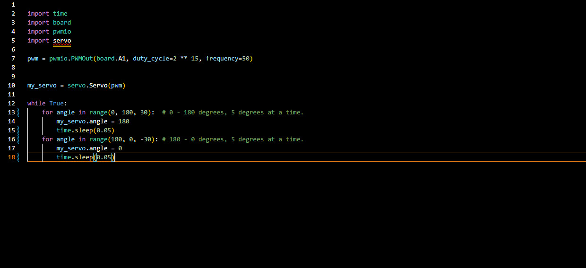
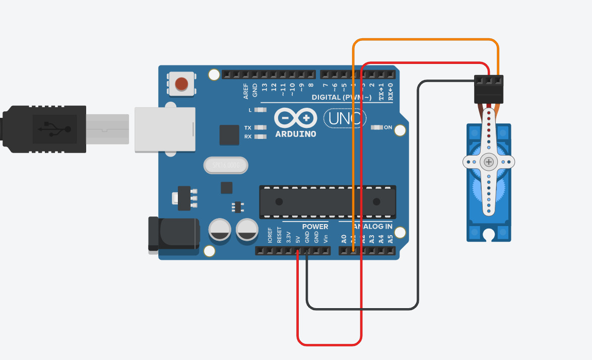

## Table of Contents
* [Table of Contents](#TableOfContents)
* [Hello_CircuitPython](#Hello_CircuitPython)
* [CircuitPython_Servo](#CircuitPython_Servo)
* [CircuitPython_LCD](#CircuitPython_LCD)
* [NextAssignmentGoesHere](#NextAssignment)
---

## Hello_CircuitPython

### Description & Code
We had to make the Neopixel on the metro board change colors.

Here's how you make code look like code:

```python
import board
import neopixel
import time

dot = neopixel.NeoPixel(board.NEOPIXEL, 1)
dot.brightness = 0.5 

print("Make it Blue!")

while True:
    dot.fill((255, 0, 0))
    time.sleep(1.0)
    dot.fill((0, 255, 0))
    time.sleep(1.0)
    dot.fill((0, 0, 255))
    time.sleep(1.0)

```


### Evidence


And here is how you should give image credit to someone, if you use their work:


### Wiring
Make an account with your google ID at [tinkercad.com](https://www.tinkercad.com/learn/circuits), and use "TinkerCad Circuits to make a wiring diagram."  It's really easy!  
Then post an image here.   [here's a quick tutorial for all markdown code, like making links](https://guides.github.com/features/mastering-markdown/)

### Reflection
The two hardest parts of this assignment were, trying to import the libraries into my Virtual Studio from the library Folder and Figuring out how to onnect the NeoPixel so that the code would work on the built in NeoPixel. To fix the Import issue in VS, first you need to find the file you want to import in your library folder in CircuitP(D:). Next you want to go into the Windows(C:) in the Navigation panel in File explorer ad click on the users folder and find your username. Next click on your username and then click on the file named Virtual Studio and then click on the lib folder. Finally the last step is to copy the file you want from your circuit python lib folder, into your Virtual Studio lib folder. You'll know that it worked becasue you should see the file you wanted in the lib folder on the side panel when you're in Virtual Studio. The Next issue that I had was trying to bridge the connection between Virtual Studio and the Metro Board. The command I used was            dot = neopixel.NeoPixel(board.NEOPIXEL, 1). "dot" is a value that I set for the neopixel, board.neopixel tells th Metro board to use the built-in neopixel as the output, and the 1 is the port to use for the neopixel.


## CircuitPython_Servo
I was tasked with making a servo sweep from 0 to 180 using Circuit Python.
This repo is a template VS code project for CircuitPython projects that automatically uploads your code to the board when you press F5.
### Description & Code
The Imports I used were Time, Board, PWMIO, and Servo.mpy. Servo.mpy allows the servo to move in two directions when you use the range function. I put the three important values for the range in the parenthesis, first the Minimum value, then the maximum value, and finally the number of degrees the servo will move each period of time.
```python
import time
import board
import pwmio
import servo

pwm = pwmio.PWMOut(board.A1, duty_cycle=2 ** 15, frequency=50)


my_servo = servo.Servo(pwm)

while True:
    for angle in range(0, 180, 10):  # 0 - 180 degrees, 5 degrees at a time.
        my_servo.angle = 180
        time.sleep(0.08)
    for angle in range(180, 0, -10): # 180 - 0 degrees, 5 degrees at a time.
        my_servo.angle = 0
        time.sleep(0.08)

```

### Evidence



### Wiring


### Reflection

Overall this assignment went well, I would say the only problem that I had was that I used the wrong pin for the servo in my code. At first I read the assignmetnand it said "So when you start searching for servo code, make sure there is a PWM object, and it is attached to a PWM pin, like D2-13, not A2!" and I thought that that meant that we shouldn't use the A pins so I connected the servo to D7 and I changed the value for the pin in this line of code ```python 
pwm = pwmio.PWMOut(board.A1, duty_cycle=2 ** 15, frequency=50)
```So I ran the code and the servo didnt move and so I was confused becasue it said to not use the A pins. After like 10 minutes of trying to figure out what was wrong, I went back and read the instructions again and I realized that it said to just not use the A2 pin, so I swapped the pin o the board and changed the code and it worked.

## CircuitPython_LCD

### Description & Code

```python
Code goes here

```

### Evidence

Pictures / Gifs of your work should go here.  You need to communicate what your thing does.

### Wiring

### Reflection


## NextAssignment

### Description & Code

```python
Code goes here

```

### Evidence

### Wiring

### Reflection
